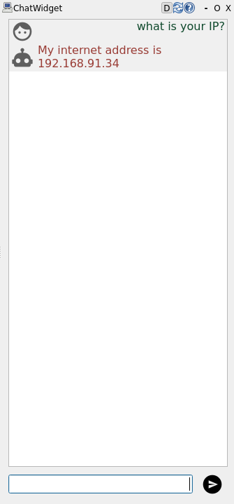
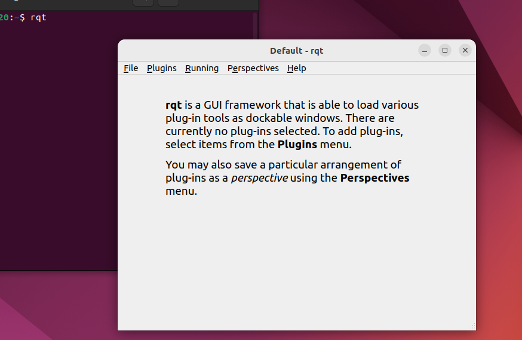
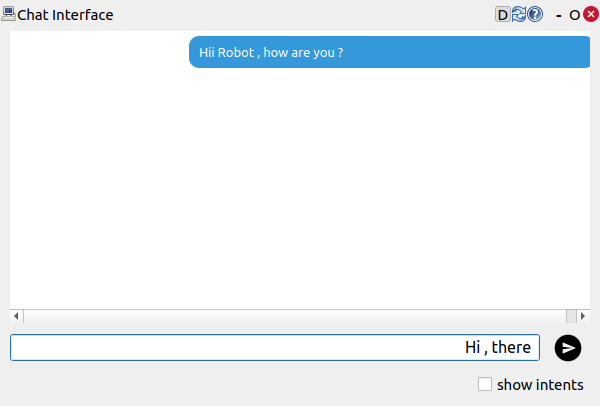

# Introduction: What is rqt_chat ?

`rqt_chat` is a simple chat plugin for `rqt`, compatible with ROS4HRI. It provides a graphical interface for chat-based communication between humans and robots using ROS2 topics and actions.



---

## Features
- Publishes user messages as `hri_msgs/msg/LiveSpeech` messages on the `/humans/voices/anonymous_speaker/speech` topic.
- Displays robot messages by calling the TTS action `/tts_engine/tts` (`tts_msgs/action/TTS`).
- Integrates seamlessly with the `rqt` framework.
---

## Prerequisites

Before setting up the `rqt_chat` project, ensure you have the following installed:

1. **ROS2 Humble**  
   Follow the [official ROS2 Humble installation guide](https://docs.ros.org/en/humble/Installation.html) to install ROS2 on your system.
   Please make sure to install the correct version compatiable with your machine.

2. **Python**  
   Ensure Python 3.8 or later is installed. You can check your Python version using:
   ```bash
   python3 --version
   ```
3. **Colcon**  
   Install colcon for building ROS2 workspaces:
   ```bash
   sudo apt update
   sudo apt install python3-colcon-common-extensions
   ```


---

## Installation Steps

### 1. Clone the Repository
Clone the `rqt_chat` repository into your ROS2 workspace and `pal_tts_msgs`:
```bash
cd ~/ros2_ws/src
git clone https://github.com/pal-robotics/rqt_chat.git
git clone https://github.com/pal-robotics/pal_tts_msgs.git
```

### 2. Install Dependencies
Install the required ROS2 dependencies:
```bash
cd ~/ros2_ws
rosdep update
rosdep install --from-paths src --ignore-src -r -y
```

### 3. Build tts_msgs 
Build tts_msgs and source it by running the command :
```
colcon build --packages-select tts_msgs --cmake-args -DCMAKE_INSTALL_PREFIX=~/ros2_ws/install
source ~/ros2_ws/install/setup.bash
```

### 4. Build rqt_chat 
Build rqt_chat and source it by running the command :
```
colcon build --packages-select rqt_chat
source ~/ros2_ws/install/setup.bash
```


---

## Running the Plugin

### 1. Launch rqt
Open any new terminal and type `rqt` to start rqt GUI:
```bash
rqt
```
You should get a new rqt window as shown below:


### 2. Load the rqt_chat Plugin
In the rqt interface:
1. Go to the menu bar and select **Plugins**.
2. Navigate to **Human-Robot Interaction** and load the **Chat interface plugin**.

You will get a chat interface like this :


---

## Troubleshooting

### Missing Dependencies
If you encounter missing dependencies, ensure you have run `rosdep install` as described above.

### Plugin Not Found in rqt
Ensure you have sourced the workspace:
```bash
source ~/ros2_ws/install/setup.bash
```

### Build Errors
If you encounter build errors, ensure all prerequisites are installed and that you have the correct versions of ROS2 and Python.

---

## Contributing
For contributing to rqt_chat, please find more information in [CONTRIBUTING.md](CONTRIBUTING.md).

